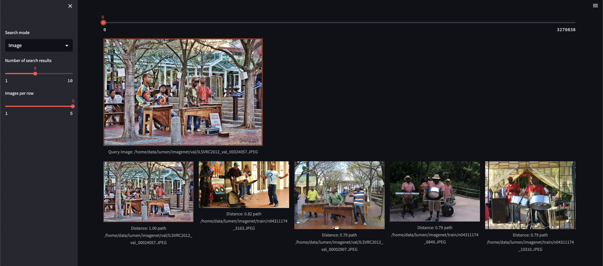
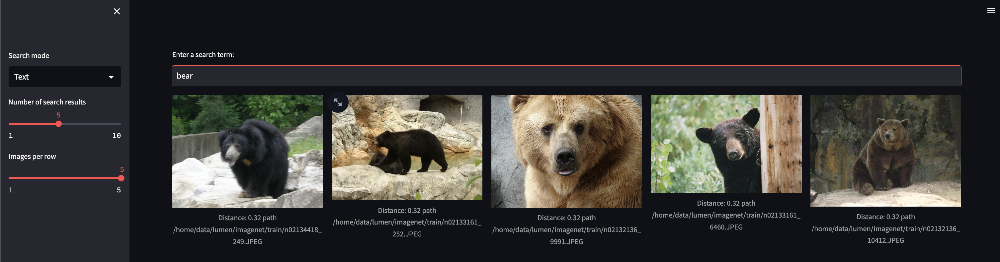

# Introduction

This code implements a versatile image search engine leveraging the CLIP model and FAISS, capable of processing both text-to-image and image-to-image queries.

# Image to image

# Text to image

# Install Environment
`pip install -r requirements.txt`

# Preprocess
`python clip_image_search/extract_embeddings.py --img_dir your_dataset_dir --save_path results/embeddings.pkl`

`python clip_image_search/build_index.py --embeddings_path results/embeddings.pkl --save_path results/index.faiss`

# Demo
`streamlit run app.py`